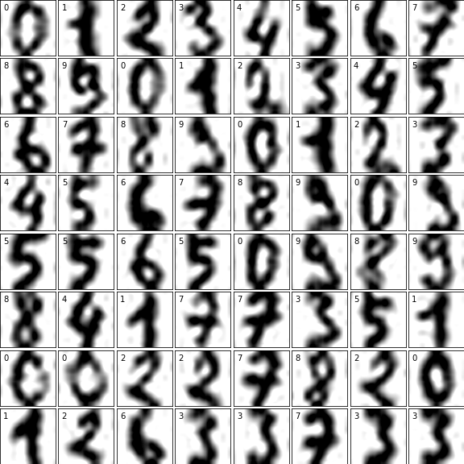
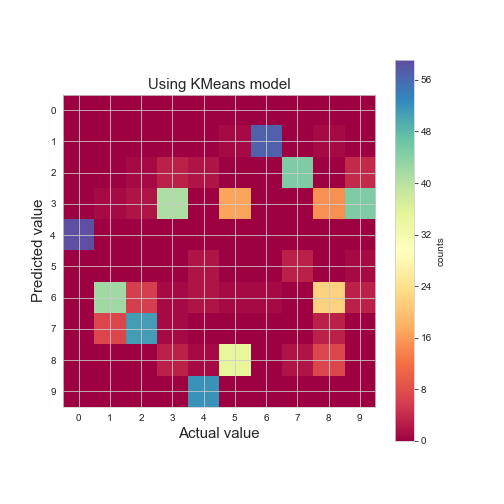
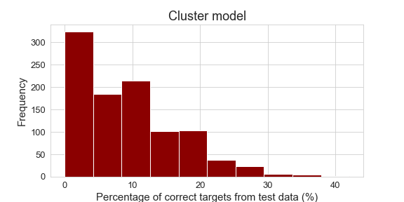
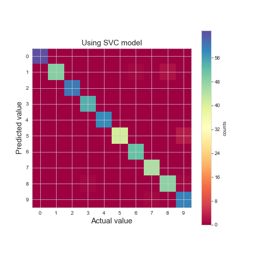
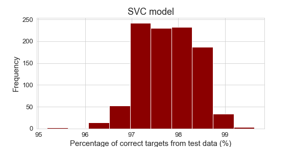

# About this project
This project is working with the digits dataset from the `sklearn` package to practice machine learning with it. 

The data from this practice set looks like:

The target values for each handwritten number appears in the top left of each box. 

My first attempts at handling the data were to lower the dimensionallity of it using Principal Component Analysis (`PCA`). However, reducing the dimensions of the problem down from 64 to 2 loses too much information from the original set - as can be seen by the very low variance ratio. This is a massive reduction, so perhaps not very surprising.

## Predicting target with Cluster and KMeans
Tried initially using `KMeans` from the `Cluster` module to model the data. 

Overall this is not an accurate method and properly matches the test and predicted targets < 20% of the time. For example, a test got a sum of 50 targets *correct*, which is 9.54 % of the test data size. Here is a heatmap to show the counts for the actual target value vs. the predicted value using KMeans:

Running this process 1000 times, here is a histogram to show the distribution of the percent of *correct* target assignments.

Obviously, there is room for improvement.

## Predicting target with Support Vector Classification (SVC)
Using the `SVC` algorithm from the `svm` module.

This method has significantly higher accuracy. For example, one test corrected assigned the target value 98.5% of the time. Here is a heatmap to show the counts for the actual target value vs. the predicted value using SVC:

Running this process 1000 times, here is a histogram to show the distribution of the percent of *correct* target assignments.

